# Intro-to-Network-Programming Final Project

## Topic: Incan Gold 印加寶藏
## Arthur: 112550189 鍾承翰, 112550112 陳景寬

### Introduction 簡介

**遊戲規則簡介：**  
- 為一個小品賭博類型桌遊，適合5~8人遊玩
- 一場遊戲可進行3~5輪，分數加總高分者勝
- 一輪遊戲開始，每一回合的順序為：
  - 抽事件 ⇨ 執行事件 ⇨ 每人暗自決策去留 ⇨ 下一回合

1. 事件有三種，隨機發生：寶石、災難、神器。  
  - 寶石：平分給正在冒險的玩家，多餘的數目留在地上
  - 災難：有五種，相同一種出現兩次強制結束，沒收所有正在冒險玩家的寶石
  - 神器：出現後留在地上，只有單獨回家的玩家可以取得
2. 決定去留：每位玩家都要在每一輪針對是否要繼續冒險做出決定。  
  - 回家：現在身上的寶石+地上剩餘寶石與其它本回合回家的玩家平分+(神器)=本局分數
  - 繼續冒險：持續挑戰獲得分數的機會，但也有可能遇到兩個相同的災難導致0分
3. 神器特殊規則：每個神器有不同的分數，出現時當下不會有任何影響，直到有任一回合只有單獨一人回家則那人可以獨享分數。

**分工：**  
- 陳景寬：Server / 報告  
- 鍾承翰：Client / SFML / SFML_Wrapper / 報告 / Github Repository maintaining

**開發與執行需求：**  
- Ubuntu 20.04、安裝SFML、gcc、g++
> [!IMPORTANT]
> Ubuntu 環境需透過以下指令安裝 SFML  
> ```sudo apt install libsfml-dev```

### Design 設計

- Server功能：維護五個房間、設立房主制度、設有房間內聊天室、遊戲運行。
  - 持續用無窮迴圈與Select一一針對有回應的所有Client 處理
  - 辨識第一個加入房間的 Client作為房主，並接收玩家人數、遊戲輪數來設定房間
  - 針對特定的指令讓該房間進入下一個遊戲階段
  - 當Client端傳送 msg: 作為前綴的內容時，為房內聊天訊息，廣播給所有房間內的玩家
  - 在遊戲結束時，於Client回傳 ok 後，引導Client回到遊戲大廳再次進行遊戲
- Client 功能與流程：
  - 在 SFML 中輸入名字(backspace鍵可以刪除，enter鍵傳送)
  - 使用5個綠色按鈕進入房間
  - 若為該房間第一人 → 成為房主
  - 透過綠色按鈕選擇玩家人數(5-8)
  - 透過綠色按鈕選擇遊戲次數(3-5)
  - 完成後左上角跳出Setting Complete!字樣
  - 不是第一人 → 房客
  - 進入房間後可以在SFML Window中透過鍵盤輸入傳送聊天對話，並顯示與右側欄位
  - 系統通知亦會進入聊天室中，以 sys: 開頭，作為系統提示
  - 等待人數足夠加入之後，房客會出現 Ready 按鈕在左下角，按下表示已經準備好
  - 全部人準備好後，房主會出現Start按鈕在左下角，按下表示遊戲開始
  - 遊戲開始後，會有紅色和綠色的按鈕可以選擇去留，以及持續作用的聊天室
  - 大家選擇完成後會進入下一關，並在左上角顯示上一輪離開的人和留下的人
  - 直到該輪遊戲結束後，會在畫面中間顯示最後一個遇到的物品，及左上角顯示的 “Ready to Next round?”，左下角則是Ready 按鈕，按下後通知所有人該名房客已經準備好，最後由房主按下Start 開始下一輪，期間亦可在聊天室交流
  - 重複以上至多輪遊戲結束後，左邊有紫色按鈕離開遊戲結束整個Client 程式或是按下白色按鈕再次進入大廳選擇房間
- 下為Server 與 Client 互動原則
<div align="center">
   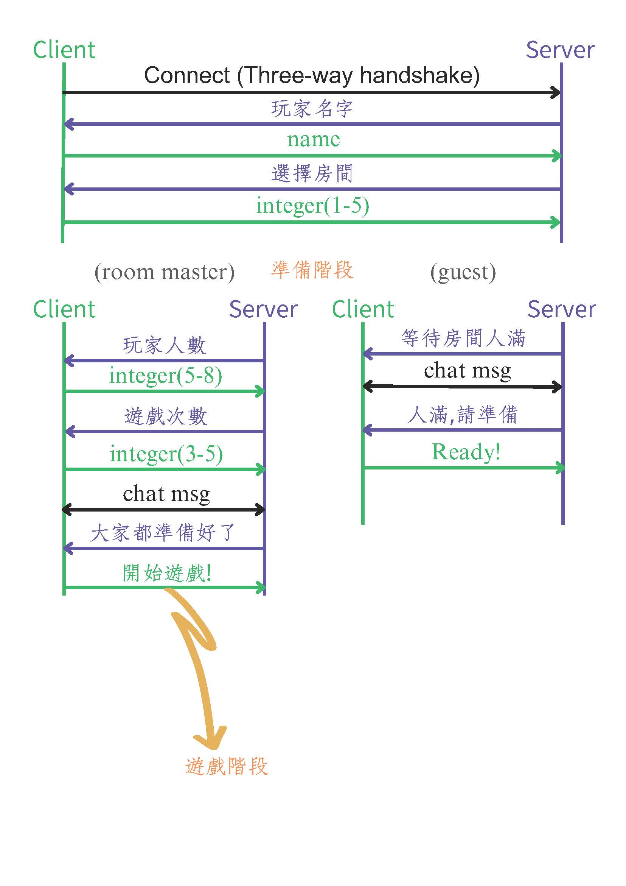
   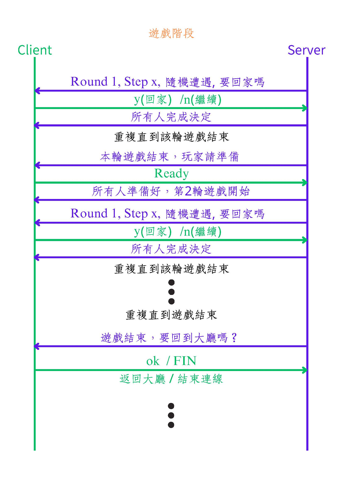
</div>

### SFML Window成果

<div align="center">
  進入遊戲：輸入名字（按下enter鍵送出）  
   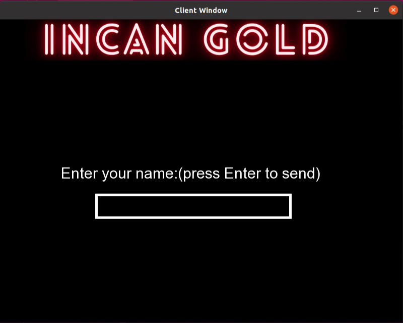  
  
  完成名字輸入後可以選擇房間，左下左下角為該玩家名字，點擊綠色按鈕選擇房間  
   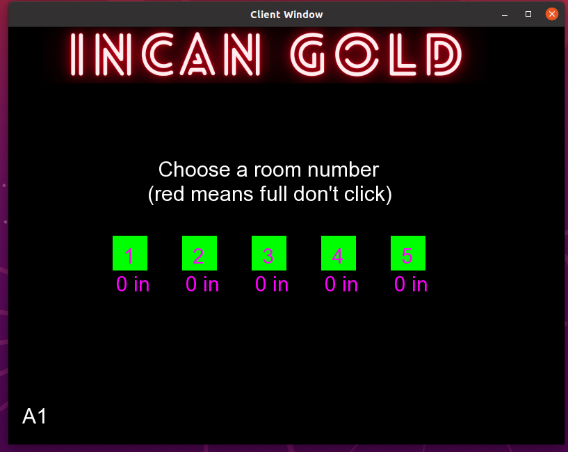  
  按鈕下方為目前人數，若該房間人數已滿，按鈕變為紅色且無法點擊該按鈕  
  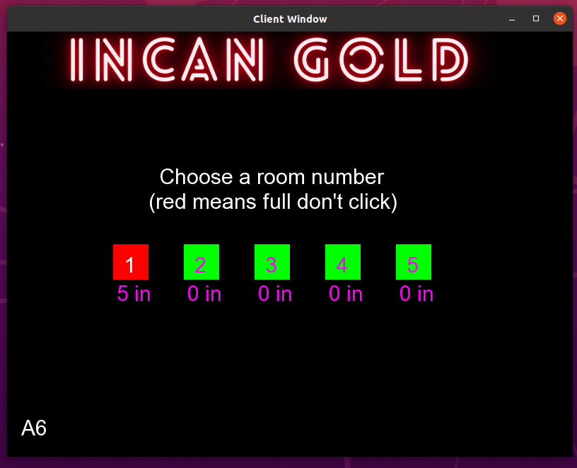  
  進入房間後，若為該房間第一個加入的人，成為房主並設定房間人數與該房間遊玩次數
  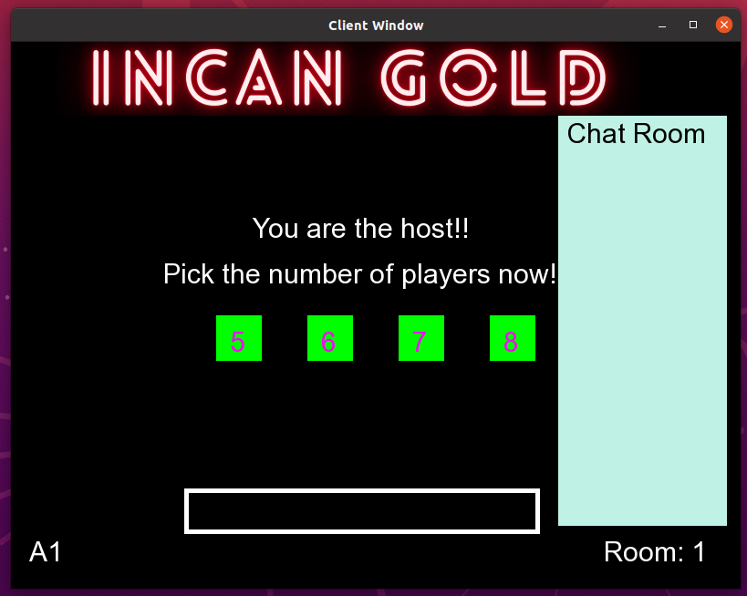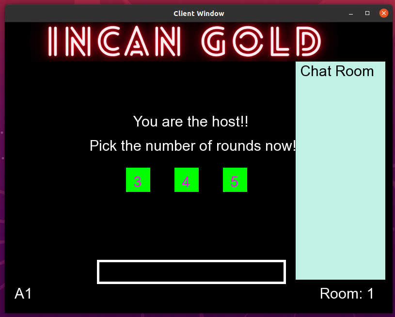  
  其餘非房主的玩家加入後即顯示印加寶藏圖片，並於右下角顯示房間號碼  
  圖片中左邊為一般房客，右邊為房主(左上角顯示Setting Complete 字樣)  
  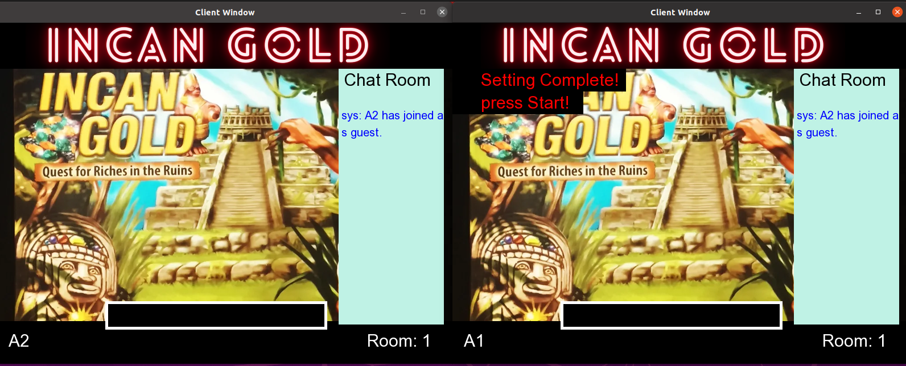  
  房間人數到達房主所設人數後，一般房客出現Ready按鈕按下即進入完成準備狀態  
  下方白色框即為輸入欄，輸入完成後按下enter鍵即可送出  
  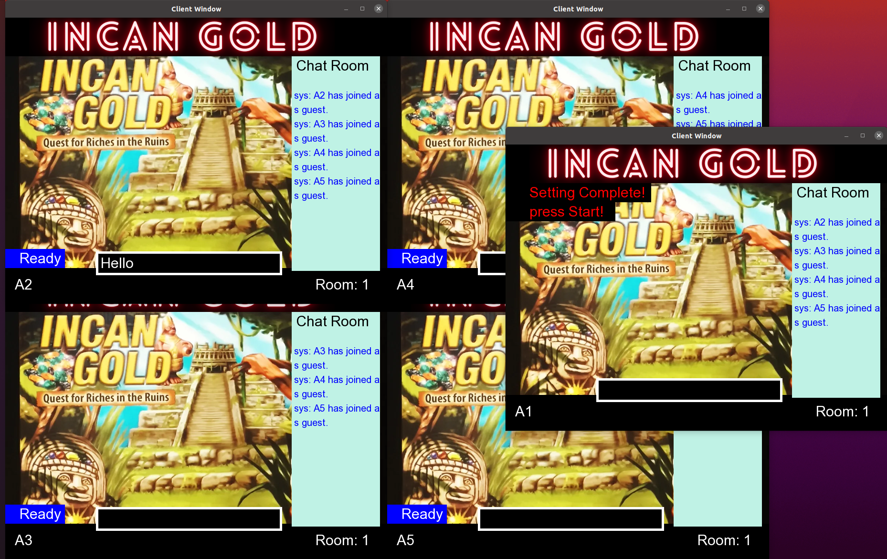  
  玩家”A2”送出”Hello”後，在房間中顯示”A2: Hello”，於A2視窗顯示”me: Hello”  
  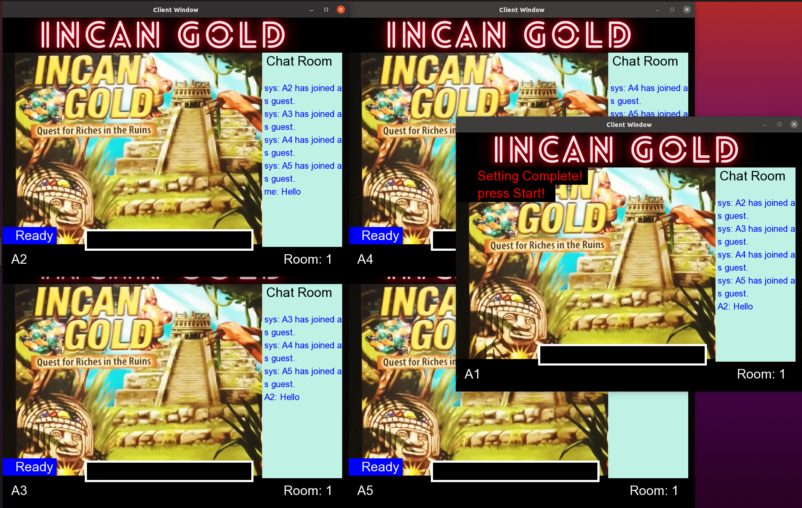  
  所有房客準備完成後，房主出現Start按鈕  
  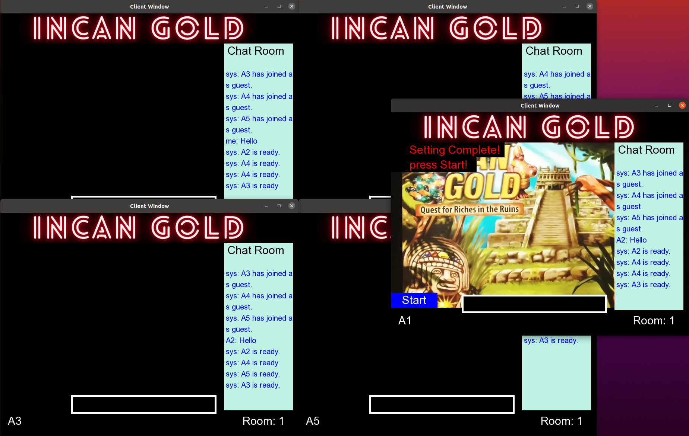  
  按下Start按鈕後即開始遊玩，出現 Leave 和 Stay兩種按鈕可以點擊，點擊後按鈕消失  
  中間下方顯示第幾輪遊戲及本輪遊戲第幾步  
  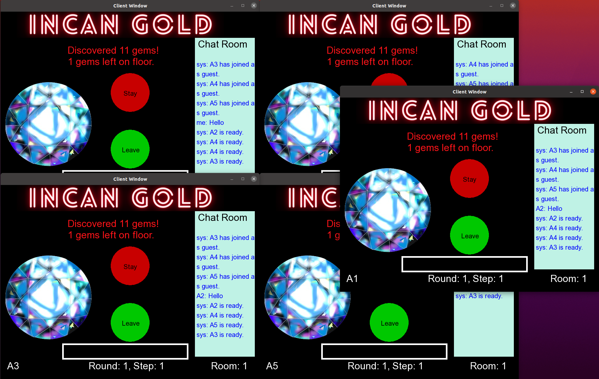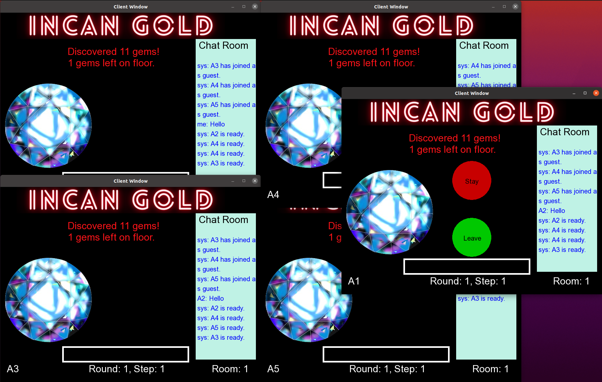  
  若玩家選擇Leave即回家，本輪遊戲再無兩按鈕可選擇，並於上方顯示名字與分數  
  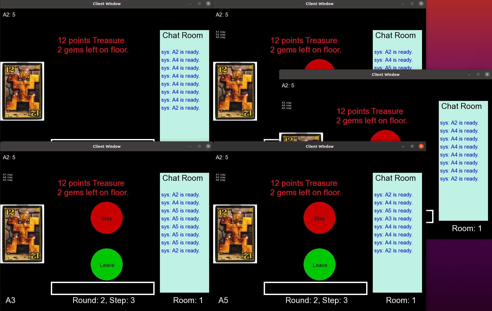  
  在所有玩家都選擇 leave之後，或是遇到相同災難後，結束該輪遊戲，若還有下一輪遊戲，進入準備畫面，房客出現Ready 按鈕，房主等待所有人準備好後出現 Start 按鈕進入下一輪遊戲  
  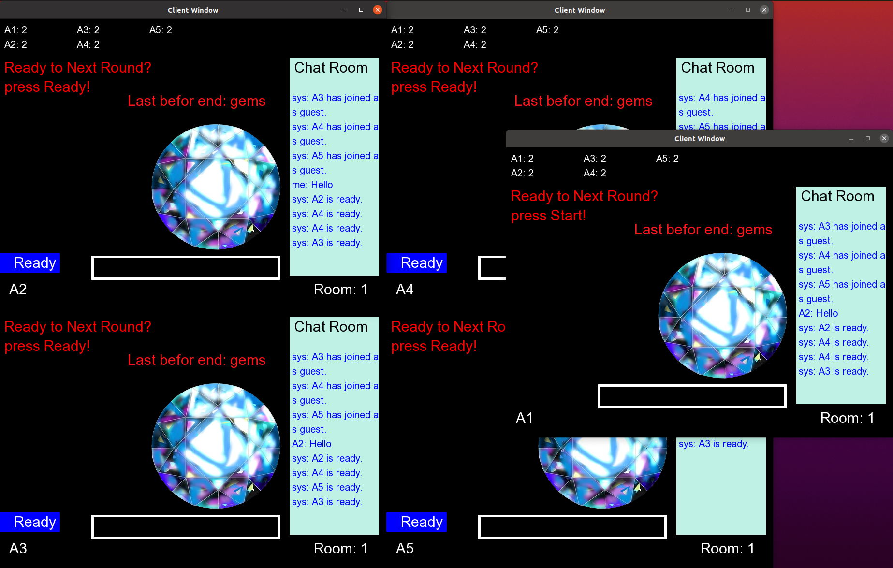  
  所有遊戲結束後，進入結束畫面，於聊天室顯示贏家祝賀訊息  
  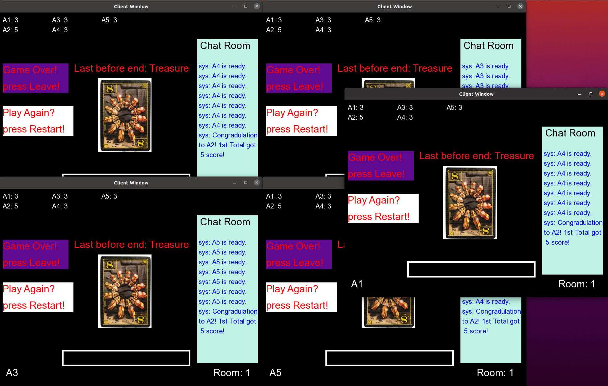  
  左側兩個按鈕紫色為關閉程式並發送FIN訊號給server，白色回到遊戲大廳選擇房間繼續遊玩  
  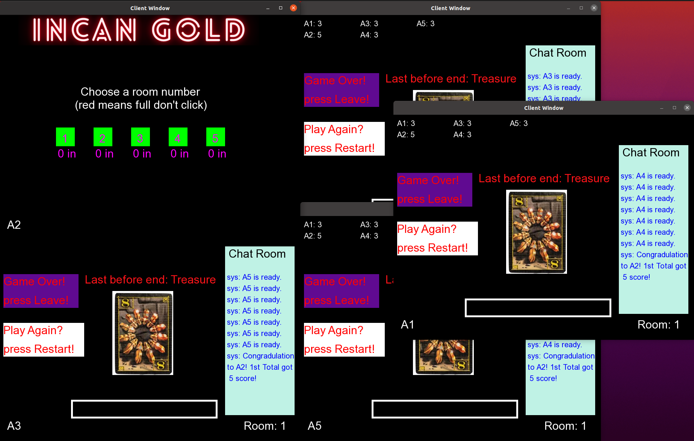  
  
  
  
</div>

### 結論(心得含困難與解決經過改進及延伸方向)

  透過這次的Final Project，我們都對於網路程式設計有更深的了解，這次在製作過程中遇到了許多困難，首先是Server部分，我們的主題是桌遊，而在遊戲中有許多不同的階段，我們需要透過溝通來設立訊號、交換訊息才能使程式順利運行，在這部分我們討論及修正花費了不少時間校正錯誤，另外Client部分我們使用了一開始我們都不會的SFML，研究了許久才運行成功，雖然過程辛苦但也讓我們認知到自己會犯下的錯誤以及學習到新的知識與技巧。而在我們的Project中，我們還有許多改進空間，在Server斷線的問題上沒有處理的非常完善，有可能導致遊戲開始後因為原本連線的人斷線而卡死無法進行，這部分是首要可以改進的目標，此外，遊戲資訊的顯示完整性也有進一步提升的空間。可以在遊戲進行時顯示更多關於遊戲規則和玩法的資訊，幫助玩家更快熟悉遊戲。最後，我們要感謝助教和教授的指導，讓我們度過了一個充實且收穫豐富的學期。從課程中我們獲益良多，也對網路程式設計有了更全面的認識！

### 參考文獻與附錄

(1) 參考文獻
https://shengyu7697.github.io/cpp-sfml/  

(2) 程式碼
https://github.com/hcchung1/Intro-to-Network-Programming/tree/main/unpv13e/tcpcliserv  
在該資料夾中的 ass6cli.c 、 sfml_wrapper.cpp、ass6serv24.c為本次使用到的程式碼
